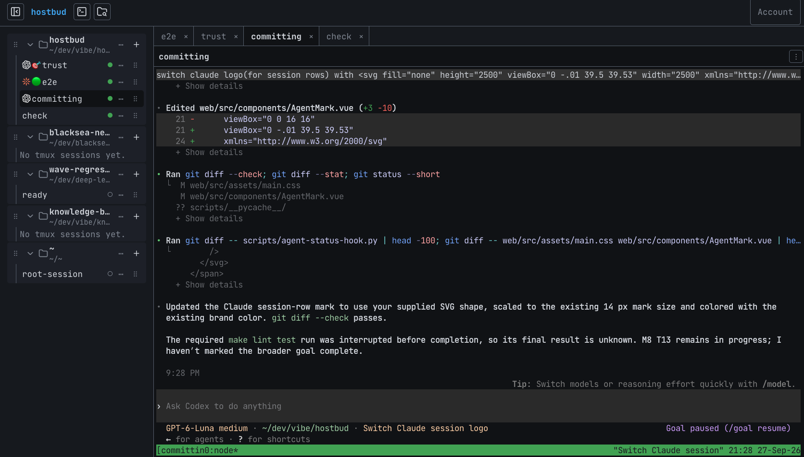

# hostbud

<p align="center"></p>

Manage the tmux sessions on your server from a web UI: browse directories, organize them as projects, and attach to sessions in a full browser terminal. Built for terminal-first and agentic-coding workflows. Self-hosted; reachable only via SSH port forward or your Tailscale tailnet. Other SSH servers can be added from the UI (**Add server**).

<p align="center"></p>

> Status: **v1** — hostbud is a single-host, self-hosted tmux web client. See [docs/ROADMAP.md](docs/ROADMAP.md).

Choose **Dark**, **Light**, **Solarized**, **Dimmed** or **System** from the Account menu. System follows the device appearance, and the selected theme applies to the interface and open terminals. Solarized uses a muted cream-sage surface at about 25% darkness; Dimmed is a deeper slate-teal at about 70%.

The app icon is an angular orange/red H on a dark background, shared by the favicon and iOS/PWA icons. Its vector master is `web/icons/hostbud.svg`; `make icons` regenerates every PNG from it. If an existing iOS home-screen shortcut keeps the old icon after deployment, remove that shortcut and add it again (you may need to sign in again).

## How it works
- Runs in Docker on one host, behind Caddy: plain HTTP on `127.0.0.1:9055` for SSH port forwarding, and HTTPS on your domain bound to the host's Tailscale IP (a Let's Encrypt certificate via Cloudflare DNS-01).
- Reaches the host's tmux over SSH using a dedicated key in your ssh-agent (private keys never enter the container) and pins the host's own SSH host keys.
- Accounts are email + password, limited to addresses you allow with plain SQL; sign-in is throttled.
- Stores accounts and UI metadata in PostgreSQL; tmux sessions live on the host.

## Quick start

Follow these steps on a fresh Debian or Ubuntu host. Replace only the example values shown; don't put real host details in tracked files.

1. **Install the host prerequisites.** Install [Docker Engine and Compose v2 on Debian](https://docs.docker.com/engine/install/debian/) or [Ubuntu](https://docs.docker.com/engine/install/ubuntu/), then install `make`, OpenSSH server/client, tmux, and Python 3 with `sudo apt update && sudo apt install -y make openssh-server openssh-client tmux python3`. Install Tailscale using its [Linux instructions](https://tailscale.com/docs/install/linux), run `sudo tailscale up`, and sign this host and the devices that will use hostbud into the same tailnet. Confirm `docker compose version`, `make --version`, `systemctl is-active ssh`, `tmux -V`, `python3 --version`, and `tailscale ip -4` work. Ensure `/etc/ssh/ssh_host_ed25519_key.pub`, `/etc/ssh/ssh_host_ecdsa_key.pub`, and `/etc/ssh/ssh_host_rsa_key.pub` exist; hostbud pins these public keys.
2. **Create a dedicated SSH key**, restricted to the Docker subnet and without forwarding:
   ```sh
   ssh-keygen -t ed25519 -N '' -C hostbud -f ~/.ssh/hostbud_ed25519
   echo "from=\"172.16.0.0/12\",no-agent-forwarding,no-port-forwarding,no-X11-forwarding $(cat ~/.ssh/hostbud_ed25519.pub)" >> ~/.ssh/authorized_keys
   ```
   The default Compose subnet is `172.29.55.0/24`, inside the restricted range. If you change `HOSTBUD_SUBNET`, keep it inside `172.16.0.0/12` and update this restriction to the same range.
3. **Load the key into a stable agent socket at boot.** With systemd's user `ssh-agent.socket`, the socket is `/run/user/<uid>/openssh_agent`. Create `~/.config/systemd/user/hostbud-ssh-add.service`:
   ```ini
   [Unit]
   Description=Load the hostbud SSH key into the ssh-agent
   Requires=ssh-agent.socket
   After=ssh-agent.socket

   [Service]
   Type=oneshot
   RemainAfterExit=yes
   Environment=SSH_AUTH_SOCK=%t/openssh_agent
   ExecStart=/usr/bin/ssh-add %h/.ssh/hostbud_ed25519

   [Install]
   WantedBy=default.target
   ```
   ```sh
   systemctl --user daemon-reload
   systemctl --user enable --now ssh-agent.socket hostbud-ssh-add.service
   sudo loginctl enable-linger "$USER"
   SSH_AUTH_SOCK="/run/user/$(id -u)/openssh_agent" ssh-add -l
   ```
   The final command should list the dedicated key. Set `HOST_SSH_AUTH_SOCK` to this socket in `.env`.
4. **Configure tailnet DNS.** Create a DNS-only A record in Cloudflare for the chosen subdomain, pointing to the host's Tailscale IPv4 (`tailscale ip -4`). The record must resolve to that address on your clients. See [Domain access over Tailscale](#domain-access-over-tailscale) for certificate and split DNS details.
5. **Configure hostbud.** From the repository, run `cp .env.example .env`. Set `HOST_UID` and `HOST_GID` to `id -u` / `id -g`, `HOST_HOME`, `HOST_SSH_USER`, `HOST_SSH_AUTH_SOCK`, `HOSTBUD_DOMAIN`, `TAILSCALE_IP`, `CLOUDFLARE_API_TOKEN`, and a new random `HOSTBUD_DB_PASSWORD`. Check that `HOSTBUD_LOCAL_PORT` and `HOSTBUD_DB_LOCAL_PORT` are unused. Protect the file and check the setup:
   ```sh
   chmod 600 .env
   make doctor
   ```
   The doctor prints check names and fixes, never secret values. Resolve failed checks before deploying.
6. **Deploy and verify health.** `make deploy` builds and starts hostbud, PostgreSQL, and Caddy. With the default port, run `curl http://localhost:9055/api/health`; it should return `{"status":"ok"}`. Check `make logs` if the containers don't become healthy.
7. **Allow the first account** (there is deliberately no web admin):
   ```sh
   docker compose exec hostbud-postgres psql -U hostbud -d hostbud \
     -c "INSERT INTO email_allowlist (email_normalized) VALUES ('you@example.com');"
   ```
8. **Verify both access paths.** From a client with SSH access, run `ssh -L 9055:localhost:9055 server-a` and open `http://localhost:9055` (use `localhost`, not `127.0.0.1`). Choose **Create account** with the allowlisted address. From another tailnet device, open `https://hostbud.example.com` and sign in. Check that the terminal can attach to a session.
9. **Optional identity gate.** If you want Tailscale identity allowlisting, follow [the optional allowlist setup](#tailscale-identity-allowlist-optional), restart Compose, and verify your login still works on the domain.
10. **Take the first backup.** Run `make backup`, confirm it reports a dump file, and copy that file to storage outside this host.

## Domain access over Tailscale
The domain works only inside your tailnet: its DNS record points at the host's Tailscale address, and Caddy listens for it on that address only. Nothing is exposed to the internet.

1. **Tailscale** on the host and on each device (phone, laptop), signed in to the same tailnet. `tailscale ip -4` on the host gives `TAILSCALE_IP` (100.x.y.z).
2. **DNS record** in Cloudflare for a subdomain, e.g. `hostbud.example.com`: type `A`, content = `TAILSCALE_IP`, proxy status **DNS only** (grey cloud). Never proxied (orange) and never a Cloudflare Tunnel: both would publish the app on the internet. The name resolves publicly, but the address only routes inside the tailnet.
3. **API token** for the certificate (ACME DNS-01; the address isn't reachable for HTTP challenges): Cloudflare dashboard → My Profile → API Tokens → Create Token → *Edit zone DNS* template, permission **Zone → DNS → Edit**, zone resources **only the domain's zone**. Put it in `.env` as `CLOUDFLARE_API_TOKEN`; only the Caddy container receives it. `ACME_EMAIL` is optional.
4. **Boot order:** Docker can only publish on `TAILSCALE_IP` once that address exists. If `hostbud-caddy` fails to start after a reboot (`cannot assign requested address`), either let the kernel bind addresses before they exist:
   ```sh
   echo 'net.ipv4.ip_nonlocal_bind = 1' | sudo tee /etc/sysctl.d/60-hostbud.conf && sudo sysctl --system
   ```
   or start Docker after Tailscale (`sudo systemctl edit docker.service` → `[Unit]` `After=tailscaled.service` `Wants=tailscaled.service`).
5. `make deploy`, then open `https://<HOSTBUD_DOMAIN>` on a tailnet device and sign in.

**Troubleshooting**
- *No certificate:* `make logs`. `could not determine zone` or `403` errors point at the token (permission or zone); certificates are kept in the `hostbud-caddy-data` volume, so restarts don't re-issue.
- *`make doctor` says the SSH agent has no key:* check `systemctl --user status hostbud-ssh-add.service`, confirm `HOST_SSH_AUTH_SOCK` names the live socket, then run `SSH_AUTH_SOCK=<socket> ssh-add ~/.ssh/hostbud_ed25519` and `make doctor` again.
- *The host's SSH key changed:* verify the host's key rotation before updating anything. If it was expected, run `make deploy` to repin the mounted public keys; if it was unexpected, investigate the host before reconnecting.
- *"host didn't answer" or SFTP timeout:* check that sshd is running and reachable, tmux is installed, and the agent has the hostbud key. The app retries terminal attachments; use **Retry now** after fixing the host.
- *Sign-in says "too many attempts":* wait for the displayed block interval before retrying. Repeated failures increase the delay; don't keep submitting passwords.
- *"Too many open terminals":* close unused tabs or split panes. Each attached terminal uses an SSH process on the host.
- *Tailscale returns 403:* confirm the device's Tailscale login or `tag:…` value is in `HOSTBUD_ALLOWED_TS_USERS` and that the LocalAPI socket is mounted when the optional gate is enabled.
- *The name doesn't resolve on a device:* check that device's DNS (`dig +short <domain> @1.1.1.1` returns the Tailscale IP). With Tailscale's MagicDNS on, a broken MagicDNS resolver on that device also breaks public names.
- *The name doesn't resolve on tailnet devices, but public DNS answers:* check Tailscale's admin console → DNS for a Split DNS (custom nameserver) entry for the domain and delete it. Such an entry names a DNS server to ask, not an address, and nothing on the host answers DNS. The Cloudflare record is all hostbud needs.
- *"request origin not allowed":* open hostbud exactly as `https://<HOSTBUD_DOMAIN>` or `http://localhost:<HOSTBUD_LOCAL_PORT>`.

### Tailscale identity allowlist (optional)

The tailnet already limits reachability. You can add a second gate for the domain site by setting `HOSTBUD_ALLOWED_TS_USERS` to a comma-separated list of Tailscale login names (or `tag:…` values for tagged nodes). Then uncomment `COMPOSE_FILE=docker-compose.yml:deploy/compose.tailscale.yml` in `.env` and set `TAILSCALED_SOCKET` to the host's tailscaled LocalAPI socket. Restart Compose after changing the list. With the override enabled, a missing or unreadable socket prevents startup; identity lookup failures return 403. The gate applies to the HTTPS domain path; SSH port-forward access through `localhost` remains exempt.

To find a login, run `tailscale whois <device-ip>` on a tailnet device and use the login shown for that node. The allowlist is an additional account gate: users still need a hostbud account.

## Using hostbud
- **Install on a phone:** open `https://${HOSTBUD_DOMAIN}` in Safari on the iPhone, choose **Share → Add to Home Screen**, then launch hostbud from its icon. The installed iOS app has a separate cookie store from Safari, so sign in once there. Android and desktop Chromium can install hostbud from the browser's install prompt.
- **Focus mode:** click the eye-off button in the top bar to turn the toggle on. When your mouse then leaves the browser window for 2 seconds, a plain screen showing “focus” covers the web app. Moving the mouse back in (or clicking that screen, or pressing Escape) removes it; the toggle stays on until you click the button again. Your sessions keep running. Phones, touch devices and the installed app (PWA) don't show the button, and focus mode stays off there.
- **Add server:** the server button in the app bar opens **Servers**. Enter a nickname, the host name or IP, the port and the login user, then **Check host key**: hostbud shows the server's SHA256 host-key fingerprints. Compare them with `ssh-keygen -lf /etc/ssh/ssh_host_ed25519_key.pub` on the server and choose **Trust and add** only if they match (nothing is trusted on first use). The server must accept the key in hostbud's agent for that user (add its public key, e.g. `~/.ssh/hostbud_ed25519.pub`, to the server's `~/.ssh/authorized_keys`), and the hostbud container must be able to reach it. Servers, their pinned keys and their projects are stored in hostbud's database. Once a server exists, **New session** and **Browse files** show a **Server** select; projects on a server carry a chip with its nickname in the tree, and its sessions that belong to no project sit in **Other sessions** with the same chip. **Remove** (after a confirmation) stops tracking a server and forgets its key; its tmux sessions keep running, and its projects must be removed first. A server's projects take queues too: their runs start on that server, and its agents' hooks call hostbud at `https://${HOSTBUD_DOMAIN}` (or `HOSTBUD_SERVER_HOOK_BASE_URL`), so the server must reach that address, e.g. over the tailnet. The Queue panel shows the server's nickname next to such a queue.
- **Browse files:** use **Browse files** in the app bar, right after the host name, to open the file browser dialog. Navigate the host over SFTP, show or hide dotfiles, create a folder, save the current directory as a project, or start a session there. The path bar's FolderPlus adds the directory being shown; it changes to FolderOpen when that path is already a project. Directory rows also use folder-plus to add a project and folder-open for an existing project. The browser requires the host's SSH/SFTP access. It can list, inspect and create folders; it has no remote delete or rename action.
- **Send a photo to a repo:** in an open session, paste an image with Cmd-V (or Ctrl+Shift+V), or use the three-dot terminal menu → **Send photos to this repo**. Hostbud sends the selected browser file directly to that session's recorded repo folder over SFTP, preserving its bytes and format without image processing. HEIC/HEIF and DNG are accepted when the browser exposes them. Each file can be up to 100 MiB. If a name already exists, hostbud adds `-1`, `-2`, etc. before the extension. After upload, hostbud pastes the path relative to the session's recorded directory at the terminal cursor (for example, `../filename`). The iOS picker controls which representation it supplies to Safari. The same paste works in the Queue panel's **Instruction** box (new or edited item): the image goes to the queue's project folder and its path (for example, `./filename`) is inserted at the caret.
- The sidebar groups host sessions under saved projects or **Other sessions** (● attached / ○ detached) and follows changes made anywhere (e.g. `tmux new -d -s x` in a real terminal) within one poll interval (`HOSTBUD_POLL_INTERVAL`, default 3s). Drag projects and sessions to set an order saved to your account. Use **Save as project** for an unmatched session to save its directory without changing the running tmux session.
- Codex and Claude Code sessions with the optional status hook below show **context tokens · total tokens used** in the terminal top bar for the active tmux pane. Hover for exact counts (and, for Codex, the reported context limit). Counts update when a hook runs (tool/lifecycle events), include cached input, and describe the agent conversation, not billing or remaining plan quota. For Claude Code, the total counts each main-conversation API response once (subagents excluded); the hook keeps per-transcript offsets in `~/.local/state/hostbud/claude-usage.json` so it only reads new transcript lines. Unknown counts stay hidden; a new conversation clears the previous counts. If you copied the handler elsewhere, update that copy.
- Optional Codex and Claude Code hooks can show **🟢 working**, **🚧 blocked or waiting**, or **🎯 ended** before a session name in the left gutter. The emoji is display-only and never renames the tmux session. To enable it user-wide on the target, add `python3 /home/dev/hostbud/scripts/agent-status-hook.py codex` handlers for Codex `SessionStart`, `SessionEnd`, `UserPromptSubmit`, `PreToolUse`, `PostToolUse`, `PermissionRequest`, `Stop`, and `Interrupt` in `~/.codex/hooks.json`; add the matching `claude` handler for Claude Code `SessionStart`, `SessionEnd`, `UserPromptSubmit`, `UserPromptExpansion`, `PreToolUse`, `PostToolUse`, `PostToolBatch`, `PermissionRequest`, `Stop`, `StopFailure`, and `Notification` in `~/.claude/settings.json`. Merge these event handlers into existing hook settings rather than replacing them, then restart the clients. The handler needs Python 3 and tmux. Claude Code runs hooks in the client's pane; Codex runs them in its shared app-server daemon outside tmux, so the handler finds the pane running `codex` in the event's directory. With several Codex windows in one directory, each new Codex session is matched to the only window not yet matched (remembered in `~/.local/state/hostbud/agent-panes.json`); when that is ambiguous, for example a second session started with `/new` in a window, the event is skipped. If a client is killed before its end hook runs and the pane returns to a known shell, hostbud infers 🎯.
  - For each listed event, add a command hook using the provider-specific command above. For example, a Codex `UserPromptSubmit` entry is `"UserPromptSubmit": [{"hooks": [{"type": "command", "command": "python3 /home/dev/hostbud/scripts/agent-status-hook.py codex"}]}]`; for Claude Code, use the same entry shape with `agent-status-hook.py claude`. Keep existing event handlers in the array. Replace `/home/dev/hostbud` with the target's actual checkout path.
- **New session**: a directory (default `~`, `~/…` works), a name (prefilled with the directory's name, numbered `name-1`, `name-2`, … if that's taken, and selected so typing replaces it and Enter creates the session; **New session here** does the same; clear it to let hostbud name it; if a name you typed is taken, hostbud opens the first free `name-1`, `name-2`, … and shows an info toast) and an optional start command such as `htop` or `claude`. The command runs in your login shell (`$SHELL -lic`, so tools on the PATH your terminal sets up are found) in the chosen directory; when it ends, the session stays open on a shell with its output still visible. Renaming to a taken name remains an error.
- ✎ renames, ✕ kills (after a confirmation); the ⋯ menu opens a session in a split.
- **Hide vs. remove:** Hide is only your account's tree preference. **Remove project…** deletes the shared project entry and its recent-command history for every account; the folder and its tmux sessions stay untouched, and sessions move to the next matching project or **Other sessions**. Removal asks for confirmation.
- **Kill all sessions of a project:** the project's ⋯ menu has **Kill all…**. It asks twice (the count, then the session names) before killing every session in the project, hidden ones included; the project stays.
- Starting a session in a project offers that project's recent commands. Choose a suggestion or enter a command, then press **Create**; opening the picker or selecting a suggestion never runs it. Each project keeps its 20 newest distinct commands; using one again moves it to the front. There is no manual history-clear action.
- A banner explains host problems (sshd unreachable, tmux missing) with the fix; hostbud recovers by itself once they're fixed.

### Customizing the tree

Drag projects and sessions, or focus a row and use Alt+↑/↓, to change their order. New rows append; hostbud does not sort by name or recent activity. Collapse a project or **Other sessions** with its chevron. Expand a session to see its tmux windows, then expand split windows to see panes; selecting a window or pane switches the attached terminal.

Rename from the pencil, row menu, F2, or the command palette. Renaming a session from a real terminal looks like the old session ended and a new one appeared. **Hide** and **Show hidden** change only your account's tree. Pin projects to keep them in the **Pinned** section; drag or use Alt+↑/↓ to order projects within their section. Create named sections with the button at the bottom of the gutter, choose an accent color, then use a project's more-actions menu to move it into a section. Drag a section by its handle to change its order. Click its color dot to collapse or expand its projects. When the selected session is hidden by a collapsed project or section, the tree marks that parent while keeping the session selected. Edit a section's name or color from its heading; deleting a section leaves its projects in the tree. Sections are thin tinted borders around projects, with no extra tree indentation. Section settings, order, pins, hidden rows, collapsed groups and expanded windows are saved to your account and survive reloads and hostbud restarts.

### Command palette

Press ⌘K (Mac) or Ctrl+Shift+K to search sessions, loaded windows, projects and actions. Ctrl+K opens the palette outside a terminal; in a terminal, it stays with the shell. Results follow tree order when scores tie. Hidden sessions are marked. The palette can rename, hide or pin tree rows, change the theme, create sessions and run app actions; killing a session still asks for confirmation. Use the **Command palette** header button on touch screens.

### Keyboard shortcuts

Press ⌘/ (Mac), Ctrl+Shift+/ or `?` to open **Keyboard shortcuts**. ⌘⇧E / Ctrl+Shift+E moves focus between the tree and terminal. ⌘Z (Mac) or Ctrl+Shift+Z sends the line editor's undo key to the active terminal; in readline-compatible shells this undoes the last text edit, including a whole bracketed paste. Ctrl+Z remains available to terminal programs. Ctrl+Shift+] / [ switches hostbud tabs; Ctrl+Shift+D toggles between the two most recently selected hostbud tabs (on Mac, Ctrl+⌘+D also works). Tree-specific keys work only when a tree row has focus. Ctrl+K inside the terminal remains the shell's kill-to-end-of-line shortcut.

### Theme

Choose **Dark**, **Light**, **Solarized**, **Dimmed** or **System** from the Account menu or command palette. The choice applies to the interface and open terminals and is saved to your account. Solarized sits at about 25% darkness with a muted cream-sage surface; Dimmed sits at about 70% on a slate-teal surface. Programs that picked their own colors for the old theme (Codex's prompt box, for example) keep them until restarted; hostbud still keeps their text readable by enforcing a minimum contrast, and restarting the program (for Codex, quit and `codex resume`) or using a fixed theme gives it matching colors. Before sign-in, the browser uses its own last theme mirror to avoid a flash; a new account starts in System mode.

### Terminal
- **Tabs:** click a session to open it in a tab (clicking it again brings its tab back); **New session** opens its session in a new tab. Tabs stay attached in the background, so switching is instant. Close a tab with ×, a middle click, or Delete on the focused tab: that only detaches the view, and the session keeps running. Drag a tab to change the order (on a phone, touch and hold it first); the order is saved with your tabs, and new tabs still open at the end. Renaming a session relabels its tabs; a session killed anywhere closes its tabs with a notice. There is no limit on open terminals; each holds its own connection to the host.
- **Splits:** from a pane's top-right ⋮ menu, choose **Split pane…**, pick right or down, then choose the session to open (or **New session…**). A list row's ⋯ → **Open in split right/down** also opens a session beside it. Tabs support up to 4 panes, nested as you like. Click a pane to type into it; drag a divider to resize (the tmux windows follow). × in a pane's header closes just that pane.
- Your tabs, splits, divider positions and focused pane are saved to your account and come back after a reload or a hostbud restart; tabs of sessions that ended meanwhile are dropped.
- **Reconnect:** if the connection drops (Wi-Fi, sleep, a hostbud restart), the terminal re-attaches by itself ("Reconnecting…", with **Retry now**); keys typed meanwhile are dropped. After a detach (`prefix d`) or the program exiting, use **Reconnect**.
- **Connection diagnostics:** open **Terminal actions → Connection diagnostics** while using a session. Type a few characters to measure input acknowledgment, and compare that with the panel's harmless `true` SSH probe (sent only while the panel is open, once every 10 seconds). It shows latest and p95 round-trip times over up to 50 samples, pending inputs, browser send-buffer size and terminal render time. Measurements never include the text you type or terminal output. High SSH command time points to hostbud-to-server SSH latency or server scheduling; high probe WebSocket time with a low command time points to browser-to-hostbud latency. PTY write is local to hostbud's SSH process and does not confirm remote receipt. Slow rendering points to the browser/device or heavy terminal output.
- **Mac editing keys:** Option+Backspace deletes a word, Cmd+Backspace deletes to the start of the line, Option+←/→ move by word, Cmd+←/→ jump to the start/end of the line.
- **Option-click** (Alt-click elsewhere) in the terminal moves the program's caret to the clicked character, also across the lines of a multiline prompt such as Codex's or Claude Code's. hostbud does it with left/right arrow keys, so it works wherever those keys move the caret.
- **Copy and paste:** select with the mouse, then Ctrl+Shift+C (Cmd+Shift+C, or Cmd+C on a Mac) or right-click → **Copy**. Ctrl+C still interrupts the program. Paste text with Ctrl+Shift+V (Cmd+V on a Mac) or right-click → **Paste**; a multi-line paste into bash, zsh, vim or Claude Code arrives as one bracketed paste and doesn't run line by line. If the clipboard contains an image file, Cmd-V (or Ctrl+Shift+V) uploads the original image to the active session's repo folder instead of sending image data into tmux.
  - When a program captures the mouse (tmux `set -g mouse on`, vim, htop), hold **Shift** while dragging (**Option** on a Mac) to select anyway, and Shift/Option+right-click for the menu.
  - Text copied inside the terminal reaches your browser clipboard over OSC 52: tmux copy-mode yanks work with tmux's defaults; for vim, Claude Code and other programs *inside* tmux, add `set -g set-clipboard on` to your `~/.tmux.conf` (hostbud never changes it). Programs can't read your clipboard: OSC 52 queries are ignored.
  - The browser allows clipboard access only on `http://localhost:…` (the port forward) and the HTTPS domain, not on a plain-HTTP LAN address.
- **Search:** Ctrl+Shift+F (Cmd+F on a Mac) or 🔍 searches the terminal's output since you attached, with Match case and Regex; Enter/Shift+Enter jump between matches, Escape closes. For older tmux history use copy mode (`prefix [`, then `?`). The mouse wheel scrolls back through the same output when tmux's `mouse` is off.
- **Links:** click (tap) a URL in the terminal to open it in a new tab; only `http`/`https` links open. OSC 8 hyperlinks (`ls --hyperlink`, Claude Code) show their real target on hover; inside tmux they need `set -as terminal-features ',xterm*:hyperlinks'` in your `~/.tmux.conf`.
- **On a phone,** the project tree is the home screen and opens as a drawer over the terminal from the **Show sidebar** icon. **New session** and **Browse files** are icon buttons in the app bar, after the host name, on phones and desktop alike. On desktop, the header's **Hide sidebar** / **Show sidebar** icon toggles it, and its state survives reload. A compact tab bar switches tabs; a split tab shows one pane at a time, with a "Pane n of m" button to switch. Tap the terminal (or ⌨) to bring up the keyboard; the terminal shrinks to stay above it, and rotating the phone resizes the tmux window. In the installed PWA, landscape mode hides Hostbud controls and the keyboard. Experimentally, the focused terminal gets 9rem of extra height below the screen so terminal clients such as Codex can use more transcript rows and move their composer below the visible edge. Portrait and regular browser layouts keep their normal sizing. The key bar supplies Esc, Tab, Ctrl, Alt, arrows and common symbols; **View terminal text** in the terminal actions menu opens a native selectable reader of all retained tmux history, including output before the browser attached. Colors and formatting are retained; long lines wrap, and you can scroll up and copy text without moving the live terminal. Swipe up or down on the terminal to scroll: in a shell it scrolls tmux's full history (tap **Done** or swipe back to the bottom to leave), and in an app that handles the mouse, such as Claude Code or Codex in full-screen mode, it scrolls the app's own history. A flick keeps scrolling and slows down, and repeated flicks go faster (experimental). **Scroll history** in the key bar offers page and line controls.

### Using hostbud on a phone

Open **Show sidebar** to switch projects or sessions without detaching the terminal. On the key bar, tap Ctrl or Alt before a key or typed character; double-tap to lock a modifier. Arrow keys follow the running program's cursor mode. Use the terminal scroll controls to browse shared pane history with tmux copy mode (tmux 2.4 or newer). Done, Bottom or typing exits copy mode. Long-press a word in terminal output to select it, then tap **Copy** in the terminal header.

To install on iPhone, open `https://${HOSTBUD_DOMAIN}` in Safari and choose **Share → Add to Home Screen**. Sign in once in the installed app; iOS keeps its cookies separate from Safari. Android and desktop Chromium can install from the browser prompt. Updates take over on the next app launch. If hostbud is offline at startup, the app shell shows **Can't reach hostbud** and retries. Installation and offline launch require the HTTPS domain or `localhost`; plain-HTTP LAN addresses are not secure contexts.

PostgreSQL credentials are supplied through the local, gitignored `.env` using the documented `HOSTBUD_DB_*` variables. They are not copied into tracked files, images or logs. For owner maintenance, use `docker compose exec hostbud-postgres psql ...` or the optional loopback-only maintenance port. Choose an uncommon `HOSTBUD_DB_LOCAL_PORT`, verify it is unused with `ss -ltn`, and never expose it on `0.0.0.0`, the Tailscale address or the public domain.

PostgreSQL is initialized as a fresh application database. The previous provisional SQLite database is not migrated because this deployment has not been used; its file, if present in the existing app data volume, is left untouched and ignored.

## Queues (v2)

A **queue** runs coding agents one after another in one project, with each item starting in its own interactive tmux session. Open the **Queue** panel from the app bar (or the command palette: *Open queue panel*).

- **Create the queue** for a saved project. All its items run in that project's directory. You can create several queues to organize work; by default only one runs at a time (see *Parallel queues* below).
- **Add items**: pick the agent (`claude` for Claude Code, `codex` for Codex); its logo appears in the picker and beside each agent-backed queue item. Add optional flags (split like a shell command, e.g. `--dangerously-skip-permissions`, `--yolo`, `--model 'opus 4'`) and a one-line instruction such as `work on milestone 2 per docs/roadmap/M2-tasks.md`. The queue defaults Claude Code to `--dangerously-skip-permissions` and Codex to `--yolo`; turn off the matching quick option to remove it. Queued items can be edited, deleted and reordered (drag, the arrow buttons, or Alt+↑/↓).
- **Default prompt (optional, per queue)**: each queue in the Queue panel has its own *Start new items with* checkbox and text (default `, commit regularly.`). Turn it on for a queue and that queue's new item instructions start with the text, with the caret in front of it, so typing `work on milestone 2` gives `work on milestone 2, commit regularly.`. Edit the text and press Save to change it for that queue. It's only a prefill: edit or delete it per item. Existing items keep their instruction. Off by default for every new queue.
- **Start**, **Pause** and **Resume** the queue. Pausing never touches the running session: the current run carries on (and is still tracked), and no new item starts.
- **Schedule a start** by picking a delay in hours and minutes beside Start (0 h 00 m starts now). The due time is saved in PostgreSQL and survives a hostbud restart; pausing cancels a pending start. The API also takes durations such as `15m` or `4h14m`, from 1 second to 30 days.
- **Loop the queue** (off by default): when the last item ends, the queue runs all its items again instead of finishing. Pick *Stop starting passes after* in hours and minutes (default 5 h, from 1 minute to 30 days). The limit counts from Start and is checked only between passes: a pass that began always runs to its end, then the queue finishes. Passes start at least a minute apart. A needs-attention item still pauses the queue; Pause cancels a pending pass. Each pass of an agent item opens a new session, so close old ones yourself; commands sent to an existing session reuse it. Start on a finished looping queue runs its items again.
- An item can either start a new tracked Claude/Codex session, or **send a command to a selected existing session**. Existing-session commands are dispatched as one literal tmux input followed by Enter, and the queue marks the item done once tmux accepts the dispatch. This reports that the command was sent, not that it finished. Verify and approval gates require a tracked agent session.
- The queue panel records and displays when the queue first started and when it finished, plus each item's first start and latest end time. Retrying an item preserves its first start and replaces its end when it finishes again.
- **History** in the Queue panel keeps item creation, edits, status changes and deletion as metadata snapshots, including commands/instructions, timestamps and the latest actionable error. It remains available after deleting a queue. History does not store terminal output, transcripts, hook payloads, tokens or session identifiers; use it to review outcomes, not resume a queue.
- Each run's session is named `<project>-q<position>` (`-1`, `-2`, … if taken); with parallel queues, a project's later queues use `<project>-<queue>-q<position>`. **Open session** shows it in a terminal tab; you can watch and type into it any time. hostbud never closes run sessions on its own: a done item's **Kill session** button, or the queue's **Kill completed sessions**, closes them after a confirmation.
- **Needs attention** means the queue paused and needs you: for a plain Claude prompt, its turn ended and you must review the work; otherwise the agent said the goal can't be achieved, exited or its session was closed, the session was `/clear`ed or restarted, the goal state couldn't be read, or there was no hook for `HOSTBUD_RUN_STALE_AFTER` (2 h by default). The item shows the reason. Then **Retry** (a new run in a new session; the old one stays open), **Skip**, or **Mark done** (asks first). The queue stays paused until you resume it.
- A plain Claude turn-end signal never proves completion by itself. Codex goal completion and legacy Claude `/goal` items advance only on structured status from their own run; text such as "achieved" in the agent's output never does.

### Parallel queues (opt-in)

Tick **Run queues in parallel** in the Queue panel to allow several queues that run at the same time; it applies at once, no redeploy. Each queue stays strictly sequential. Off still lets you create queues (to organize work), but only one runs at a time: Start and Resume are disabled while another queue runs, and the server refuses them saying which queue to pause first. Switching it off never stops a run. `HOSTBUD_PARALLEL_QUEUES` in `.env` (default `false`) is only the initial value until you use the switch.

- **New queue** in the Queue panel creates another one (names are unique per project). The switcher shows every queue: buttons on a desktop, a select on the phone. **Rename** and **Delete queue** (asks first; refused while a run is active) act on the queue shown.
- **Start after (optional)** links a new queue to something already running:
  - *Active goal is achieved*: a running hostbud queue session. The new queue waits until that agent's structured goal is achieved; a stale run can still release it if achievement arrives late. If the linked run fails, exits or is cancelled, the dependent queue pauses.
  - *Existing session is idle*: any tmux session, including ones you started by hand. The queue's first item waits until that session's agent finishes its turn or exits (the optional agent status hooks report `blocked` or `ended`), or the session closes. A session with an open agent but no status hooks counts as busy until the agent exits; a plain shell counts as idle. Only the first item waits; later work in that session never holds the queue back.
- **Same directory**: when two running queues work in the same project directory, both show a warning, because their agents may edit the same files. hostbud doesn't block it.
- **Run cap**: **Account → Settings** (or *Open settings* in the command palette) sets *Maximum parallel runs* for the machine, 1–32. Parallel queues default to a cap of 2; clearing the setting restores 2. The cap applies only while **Run queues in parallel** is enabled, and changing either setting asks for confirmation. When the cap is reached, the next item stays queued with "waiting for a free slot" and starts when a slot frees up. Slots go to queues in the order they started waiting (a queue whose run just ended goes to the back), so with a cap of 1 the queues take turns. A run that went stale keeps its slot until you act on it (Retry, Skip, Mark done); a failed or exited run frees it at once. Lowering the cap stops nothing; raising it starts waiting queues right away.

Requirements on the host: Claude Code **2.1.283** or newer and/or Codex **0.157.1** or newer (on your login shell's `PATH`), and `curl`. hostbud installs nothing and changes no settings file: hooks are passed per run (`claude --settings`, `codex -c hooks.…`), and the run token reaches tmux through stdin, never a command line.

- **Trust the project folder once** in each client (start `claude` / `codex` there by hand and accept the trust prompt). Until then the client waits at its trust prompt and the run is flagged after the stale window.
- **Codex asks once to trust hostbud's hooks** ("Hooks need review" → *Trust all and continue*) in the first run's session. The hook command is the same for every run, so this is a one-time step.
- Codex starts with the plain condition as its prompt, and hostbud sets the goal through Codex's own app server (`codex app-server proxy`) right after the session starts.

### Notifications (opt-in)

hostbud can tell you when a queue item is **done**, when one **needs attention**, and when a **queue has finished**. It is off for every account until you turn it on, and each account chooses its own events.

- **Turn it on** in **Account → Settings → Notifications** (*Notify me*). Only that click asks the browser for permission. If you deny it, the switch stays off and Settings says how to allow notifications in the browser's site settings. Pick the events under *Notify when*; **Send test notification** checks this device.
- **While hostbud is open**, the page shows the notification itself. A click opens the Queue panel on that item.
- **While hostbud is closed** (Web Push), the browser's push service delivers it. This needs VAPID keys on the server: run `make vapid-keys` (it prints a pair from a container and writes nothing), paste both lines into `.env`, set `HOSTBUD_VAPID_SUBJECT` to a `mailto:` address or an https URL of yours, and `make deploy`. Without the keys (or with an invalid one) hostbud still starts, in-app notifications still work, and Settings shows *Push is off* with the vars to set.
- **iPhone and iPad** (iOS 16.4 or later) get notifications only in the installed app: in Safari tap **Share → Add to Home Screen**, open hostbud from the home screen, then turn notifications on there. In a Safari tab, Settings says so and asks for nothing.
- **Each device** subscribes on its own and follows the signed-in account: signing out removes that device's subscription, and one that blocks notifications later drops its subscription (Settings says *Notifications are blocked on this device*). Other devices keep theirs.
- **What's shown:** the project name, the item number and the outcome (for example "app: item 2 needs attention"). Never the instruction, flags, paths, session names, agent output or tokens.
- **Outbound HTTPS:** push needs the `hostbud` container to reach the browsers' push services on port 443 (for example `fcm.googleapis.com`, `web.push.apple.com`, `*.push.services.mozilla.com`). hostbud only connects to public addresses there, follows no redirects, and retries a failed delivery at most three times; an expired subscription is removed.

### Completion gates (opt-in, per item)

Codex items use Codex's thread goal status and advance when that goal is complete. Claude Code does not expose an authoritative completion status for an ordinary prompt, so hostbud pauses after its first turn and asks you to review the work and mark it done or retry it. Existing Claude queue items that begin with `/goal` keep their automatic goal tracking. An item can also require a **verify command** that exits 0 and/or your **approval** before it counts as done and the queue moves on. Both are empty by default; set them per item in the Queue panel (*Verify command*, *Require approval*).

- **Writing a verify command.** It runs as argv, not through a shell: words are split like the flags field (quotes group words, nothing is expanded), so `make test` or `go test ./...` work as typed, while `&&`, `|`, `;`, `$(…)` and globs are passed as literal arguments. For a pipeline or several commands, say so explicitly: `sh -c 'make lint && make test'`. At most 4096 bytes, one line.
- **What runs where.** hostbud runs the command itself, over its own SSH connection to the host, as your host user, in the project's directory — never inside the agent's tmux session and never typed into it. It is stopped after `HOSTBUD_VERIFY_TIMEOUT` (10 minutes by default, 5 seconds–2 hours) with coreutils' `timeout`, which must be installed on the host (`sudo apt install coreutils`). While it runs the item shows *Verifying*, the queue waits, and (with parallel queues) the command holds the queue's run slot.
- **Exit 0** moves the item on (to approval, or done). Anything else — a non-zero exit, the timeout, a missing project directory, `timeout` missing, an SSH failure — sets it to **Needs attention** with the reason, and the queue pauses. The item shows the command's exit code, duration and the last 16 KiB of its combined output (as text; colors and control characters are stripped). The output is never logged or sent in notifications.
- **Re-run verify** runs the command again without rerunning the agent (for example after you fixed a test by hand). You can change only the gates of a needs-attention item, to fix a bad verify command first. **Retry** reruns the agent, and its new run goes through the gates again; **Mark done** skips the remaining gates.
- **Approval**: an item that requires it waits in *Awaiting approval* (the queue waits too; nothing runs, so it holds no run slot). **Approve** marks it done and the queue moves on; **Reject** (asks first) sets it to needs attention and pauses the queue. With notifications on, a pending approval and a failed verify notify as *needs attention*; *done* is only sent once the item has passed its gates.

### Quiet run supervisor (V2-M5, optional)

The supervisor is off by default. To enable it, set `HOSTBUD_LLM_PROVIDER=openai`, `HOSTBUD_LLM_MODEL`, and `OPENAI_API_KEY`, then deploy. `HOSTBUD_LLM_QUIET_AFTER` defaults to 20 minutes and `HOSTBUD_LLM_MAX_PER_RUN_HOUR` to two calls per run. It classifies only running or stale items and only adds an advisory flag. Even a *Looks finished* flag never advances a queue; check the session and use **Mark done** yourself.

Classification sends recent terminal pane output from the host to the configured provider. Before sending, hostbud strips terminal controls, scrubs common credential patterns by default (`HOSTBUD_LLM_SCRUB=true`), and caps the text at 8 KiB. Treat this as external disclosure: output may still contain sensitive information that pattern scrubbing cannot recognize. Pane text and provider responses are not stored or logged; only a scrubbed label and short reason are retained. `HOSTBUD_LLM_BASE_URL` is optional and accepts HTTPS, or HTTP to a single-label Compose service name for a local fake. The supervisor has bounded requests and a per-run hourly budget; set the model and budget to match your provider's pricing before enabling it.
- If hostbud restarts while a verify command runs, it doesn't run it again: the item needs attention, and **Re-run verify** starts it.

## Limits and timeouts

One SSH command and one SFTP metadata operation each time out after 10 seconds by default. Photo uploads allow up to 100 MiB and time out after 5 minutes by default; set `HOSTBUD_UPLOAD_TIMEOUT` in `.env` to adjust it (30 seconds through 10 minutes). A timeout returns an actionable error and the app retries the host connection; repeated SSH timeouts reset the app's ControlMaster connection. Set `HOSTBUD_EXEC_TIMEOUT` or `HOSTBUD_SFTP_TIMEOUT` in `.env` to change their limits (each accepts 2 seconds through 2 minutes).

By default there is no per-account cap on attached terminals; the server accepts at most 128 across all accounts. A full limit returns **Too many open terminals** before another SSH attach starts. Set `HOSTBUD_MAX_TERMINALS` (1–1024) in `.env` to change the server-wide cap, or `HOSTBUD_MAX_TERMINALS_PER_USER` (0–1024, 0 = none) to add a per-account one.

HTTP requests, WebSockets, SFTP listings and database queries also have fixed bounds. Oversized JSON requests return 413, an unexpected content type returns 415, oversized headers return 431, and slow or unavailable host/database calls return a timeout or service error instead of waiting indefinitely. The complete inventory and server behavior are in [Architecture §15](docs/ARCHITECTURE.md#15-limits-and-timeouts).

Example whitelist maintenance SQL (replace the placeholder address; never commit real addresses):

```sql
INSERT INTO email_allowlist (email_normalized, enabled, note, created_at, updated_at)
VALUES ('owner@example.com', TRUE, 'owner', now(), now())
ON CONFLICT (email_normalized) DO UPDATE
SET enabled = EXCLUDED.enabled, updated_at = EXCLUDED.updated_at;

-- Stop an address from signing in again (the account is kept):
UPDATE email_allowlist SET enabled = FALSE, updated_at = now() WHERE email_normalized = 'owner@example.com';

-- Lift sign-in throttling (e.g. after locking yourself out):
DELETE FROM login_rate_limits;
```

Run it with `docker compose exec hostbud-postgres psql -U hostbud -d hostbud` (the values of `HOSTBUD_DB_USER` / `HOSTBUD_DB_NAME`). Addresses are stored lowercased; sign-in throttling settings are in `.env.example`.

See [docs/ARCHITECTURE.md](docs/ARCHITECTURE.md) for details.

## Backup and restore

Run `make backup` to create `backups/hostbud-<UTC timestamp>.dump`, a private PostgreSQL custom-format dump. The command creates `backups/` with mode 700, sets the dump to mode 600, and prints its filename and size. It uses the runtime `pg_dump`; if that client is older than the database server, backup stops with an install hint.

Check a dump without touching the configured database:

```sh
make restore-check FILE=backups/hostbud-20260927T120000000000000Z.dump
```

The check restores to a temporary database, verifies the migration version and counts of users, allowlist entries, projects and UI state, then drops the temporary database. For a real restore, use `make restore FILE=…`; it validates the dump, shows the target database and requires typing its name. Non-interactive use must pass `CONFIRM=<database>`. Restore takes a safety backup first, stops only the app while applying the dump in one transaction, starts it again, and waits for health.

A database dump does not include `hostbud-data` (regenerated SSH configuration and ControlMaster sockets plus `auth-key` used for rate-limit hashing), Caddy certificates (`hostbud-caddy-data`), or `.env`. Losing `auth-key` resets throttling buckets; Caddy can reissue certificates, subject to Let's Encrypt rate limits. Keep `.env` in a password manager and copy `backups/` off the host.

## Development
Everything runs in containers; the host only needs Docker and `make` (`make help` lists targets). Tools run in long-lived `hostbud-tools-*` containers that `make` execs into (created on first use; `make tools-down` removes them).
- `make build` — build the Vue app (`web/dist`) and the Go binary with it embedded (`bin/hostbud`). `make go-build` alone embeds whatever is in `web/dist` and serves a placeholder page if the frontend was never built.
- `make lint test` — golangci-lint, eslint, vue-tsc; Go unit + integration tests and Vitest. Integration tests run against throwaway sshd containers (`hostbud-test-sshd`, `hostbud-test-sshd-notmux`) that `make test` starts and keeps running between runs; `make test-down` removes them. `make go-unit` runs only the Go unit tests.
- `make e2e` — simulated-user tests (Playwright, desktop Chromium + iPhone 13 Pro/WebKit) against a throwaway target in a separate `hostbud-e2e` Compose project, never the real host. It starts a fresh stack, runs, and tears it all down; failure traces, screenshots and videos land in `test/e2e/results/`. For a fast edit/test loop, `make e2e-up` keeps the stack running, `make e2e-run` runs the suite against it (`ARGS="-g smoke"` filters), and `make e2e-down` removes it. Images rebuild only when their inputs change.
- `make hooks` — install the gitleaks pre-commit hook.
- `make deploy` — build the image and (re)start `hostbud` + `hostbud-caddy` (`docker compose up -d --build`); `make logs` follows their logs. Check with `curl http://localhost:9055/api/health`.
- `make docker-clean` — free hostbud's Docker disk: untagged images, the e2e stack and its images, the toolbox containers (`CACHE=1` also prunes BuildKit cache older than 72h, for every project on the host). Builds keep Go/pnpm caches in BuildKit cache mounts, so a deploy adds only a few MB; `make deploy` and the test scripts drop the images they replace.
- `make backup` — create a PostgreSQL backup in `./backups/` (gitignored).

## License
MIT
